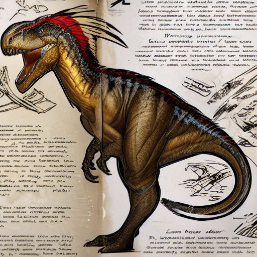

# Overview

My first LoRA (low-rank adaptation) fine-tuning of a Stable Diffusion model to generate ARK: Survival Evolved dinosaurs as pictured in the dossiers (example below). This is to be improved upon, as the generated output is nice but still very eroneous and I would like to use this in a more ambitious project coming later.

The lora is available on Hugging Face: https://huggingface.co/oliverbrown/ark-dinosaur-lora

## Methodology

### naive approach

I first looked to see if there was a simple way to do this, and i knew it wouldn't work but tried anyways. I asked GPT-5 to create a dossier image of the **Icthyosaurus** from ARK: Survival Evolved and gave a dossier of a different dinosaur as an exmaple, with the following prompt:

```text

Please create a Dino Dossier for the dinosaur described below, in the form and art style of ARK: Survival Evolved.
Please do some research before hand to know what the dossier should look like, use a random layout of text and images
based on existing dossiers. The main drawing of the dinosaur should be coloured, the rest in black and white on parchment
paper. For the text, there should be 2 sections, Wild and Domesticated. The text should be a diary of someone's encounter
of the dinosaur in First-Person when it is Wild and when Domesticated (tamed). Include in the text its abilities, behaviours
and appearance. You will create a dossier for the following dinosaur:

Common Name: Ichthyosaurus
Species: Ichthyosaurus Curiosa
Time: Late Triassic-Early Jurassic
Diet: Carnivore
Temperant: Curious
```

The result:


Additionally I also tried this with Google's Whisk:


Not bad, but definitely not the same art style.

### Low Rank Adaptation (LoRA)

This was my first time experimenting with Image GenAI models, especially Stable Diffusion. I decided to create a LoRA based on 25 cropped dossier images using Kohya SS, and then established a workflow on ComfyUI. More info to come, some example results:

#### Megalodon 


#### Icthyosaurus


#### Raptor?




## Copyright Notice

All images used to train the LoRA come from official ARK dossiers revealed in trailers and stuff for dinosaurs added to the game, all of these images belong to Snail Games, and I intend to keep this as a personal project and not to market anything.

